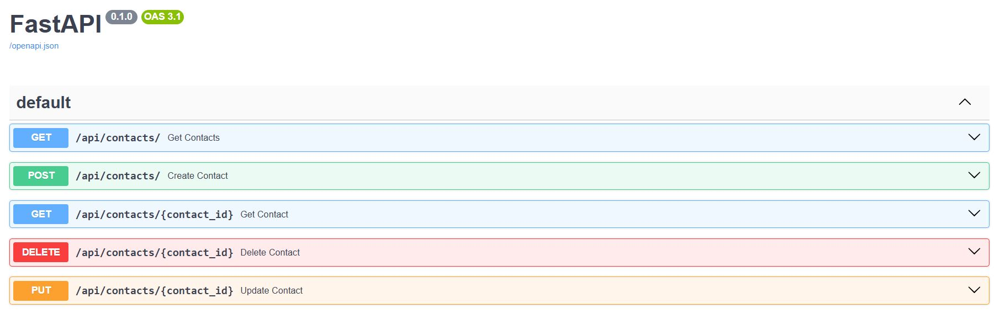
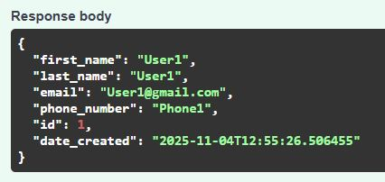
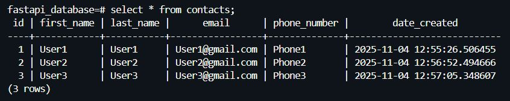
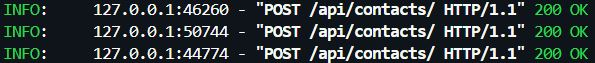
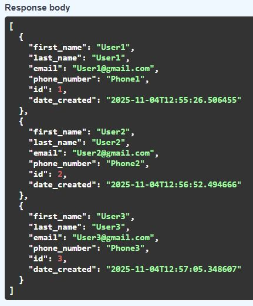
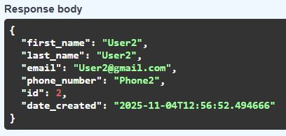
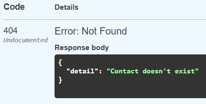
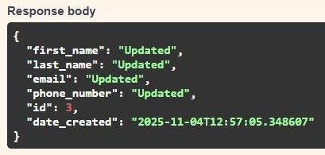
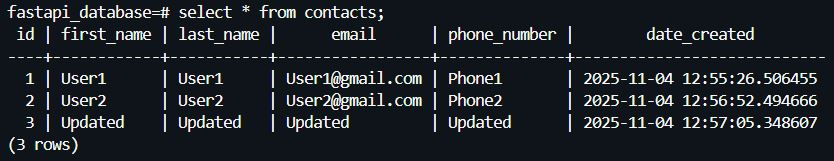
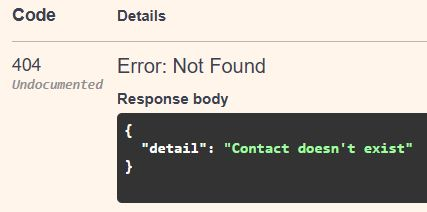

<h1 align="center"> ⚡ CRUD operations with FastAPI </h1>

 Aplicación backend construida con FastAPI que permite realizar operaciones CRUD (Create, Read, Update, Delete) sobre una BD PostgreSQL. 

<h2 align="left"> ● Pasos: </h2>

1. En una terminal se ejecuta el comando <code>docker run --name fastapi-postgres -e POSTGRES_PASSWORD=password -d -p 5432:5432 postgres:14.17</code> para crear un contenedor PostgreSQL con Docker.

2. Se inserta el comando <code>docker exec -it fastapi-postgres psql -U postgres</code> para acceder a la consola interactiva de PostgreSQL dentro del contenedor <code>fastapi-postgres</code>.

3. Se crea una base de datos mediante el comando <code>create database fastapi_database;</code>.

4. Se crea un usuario mediante el comando <code>create user myuser with encrypted password 'password';</code>.

5. Se le añaden permisos al usuario para que pueda realizar operaciones sobre la base de datos mediante el comando <code>grant all privileges on database fastapi_database to myuser;</code>.

6. Accedemos a <code>fastapi_database</code> mediante el comando <code>\c fastapi_database</code>.

7. En una nueva terminal, creamos un entorno virtual <code>python3 -m venv venv</code> y lo activamos <code>source venv/bin/activate</code>. Posteriormente, instalamos los recursos necesarios <code>pip3 install "fastapi[all]" SQLAlchemy psycopg2-binary</code>.

7. Introducimos el comando <code>uvicorn main:app --reload</code> para ejecutar la aplicación FastAPI.

8. Accedemos a <code>http://127.0.0.1:8000/docs</code> para probar las funcionalidades de la API implementada.

  

<h2 align="left"> ● Post: </h2>

Ejm: Se añaden 3 contactos a la tabla <i>contacts</i>. Para ello, se sigue el siguiente esquema:

{ 
  "first_name": "string", 
  "last_name": "string", 
  "email": "string", 
  "phone_number": "string" 
}
  

  

  

  

<h2 align="left"> ● GET: </h2>

Se muestran todos los contactos de la tabla <i>contacts</i>.

  

  

<h2 align="left"> ● GET {contact_id}: </h2>

Ejm: Se quiere mostrar toda la información del contacto con <i>id = 2 (existe)</i> de la tabla <i>contacts</i>.

  

Ejm: Se quiere mostrar toda la información del contacto con <i>id = 4 (no existe)</i> de la tabla <i>contacts</i>.

  

  

<h2 align="left"> ● PUT {contact_id}: </h2>

Ejm: Se quiere actualizar el contacto con <i>id = 3 (existe)</i> de la tabla <i>contacts</i>. Para ello, se sigue el siguiente esquema:

{ 
  "first_name": "string", 
  "last_name": "string", 
  "email": "string", 
  "phone_number": "string" 
}
  

  

  

Ejm: Se quiere actualizar el contacto con <i>id = 4 (no existe)</i> de la tabla <i>contacts</i>.

  

  

